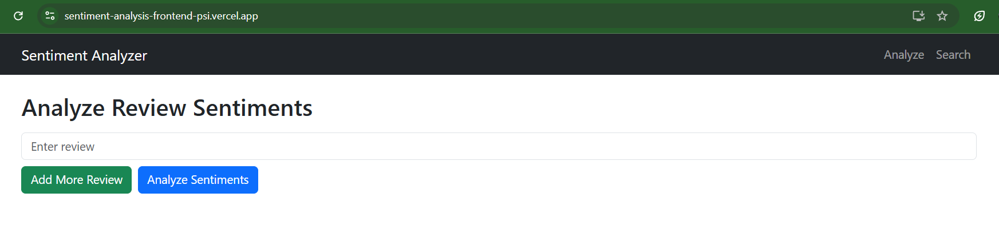
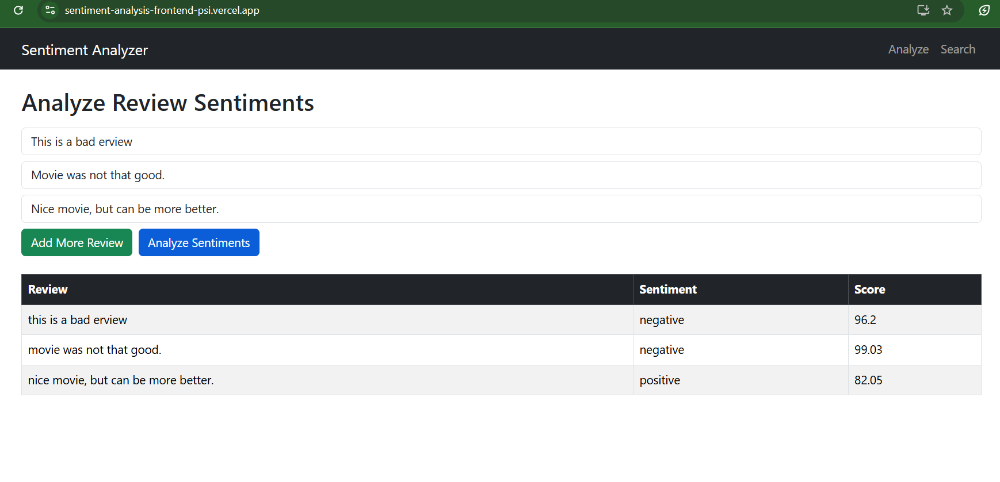
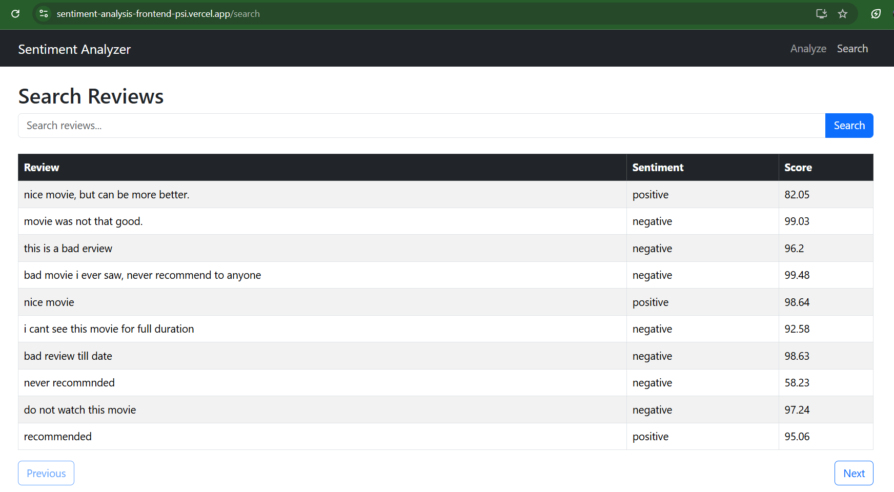

# Sentiment Analysis Frontend


## 🌐 Live URL

The frontend is deployed and accessible at:

[Sentiment Analysis App](https://sentiment-analysis-frontend-psi.vercel.app/)


## 📌 Overview

This is the **frontend** for the Sentiment Analysis application. It provides an easy-to-use interface to analyze movie reviews and view stored sentiments. The backend utilizes a **fine-tuned LLM model** for sentiment classification, deployed on Cohere in the backend.

The frontend is built with **React.js** and is fully **Dockerized** for production deployment.

## 🚀 Features

- **Analyze Page**: Add multiple reviews (up to 10 at a time) and analyze their sentiment.
- **Search Page**: View all stored reviews, including sentiment and score.
- **Text Search**: Search reviews using a text-based search on review content.
- **Pagination**: Navigate through stored reviews efficiently.
- **Fully Dockerized**: Can be deployed using Docker or Docker Compose.
- **Deployed on Vercel**: Live at:  
  👉 [Sentiment Analysis Frontend](https://sentiment-analysis-frontend-psi.vercel.app/)


---

## 🏗️ Tech Stack
- **Frontend**: React.js, Bootstrap (for styling)
- **Backend**: FastAPI, PostgreSQL, Cohere API (for sentiment analysis)
- **Deployment**: Vercel (frontend), Render (backend), Docker (for containerization)

---

## 🌐 Backend Details

This frontend interacts with a **FastAPI backend**, which is deployed at:  

👉 **Backend API Docs**: [`Sentiment analysis backend`](https://sentiment-analysis-backend-nu7h.onrender.com/docs)  

The backend utilizes a **fine-tuned Cohere model** trained on IMDb reviews for sentiment classification.

---

## 🛠️ Local Setup

### **1️⃣ Clone the Repository**
```sh
git clone <https://github.com/manas-sde/sentiment-analysis-frontend.git>
cd sentiment-analysis-frontend
```

### **2️⃣ Create a `.env` File**
In the root folder, create a `.env` file and add the backend URL:
```
REACT_APP_BACKEND_URL=http://localhost:8000  # Or use the production backend URL
```

### **3️⃣ Run with Docker**
Build and run the frontend using Docker:
```sh
docker-compose up --build -d
```
The app will now be accessible at **http://localhost:3000**.

### **4️⃣ Run in Development Mode**
For development without Docker, use:
```sh
npm install
npm start
```
This will start the React app on **http://localhost:3000**.

---

## 📸 Screenshots

### **Analyze Page**
_Add and analyze multiple reviews at once._



### **Search Page**
_View past reviews, search by text, and filter results._


---

## 🔧 Areas for Improvement
- **Response Time**: Backend response time is slow for initial calls, as it is deployed on free server, so servers gets spin down due to prolonged inactivity.
- **Better UI/UX**: Can be more visually appealing and user-friendly.
- **Sorting Option**: Allow sorting reviews by sentiment score.
- **Performance Optimization**: Improve API request handling and response time.

-------------------------------------------------------------------------